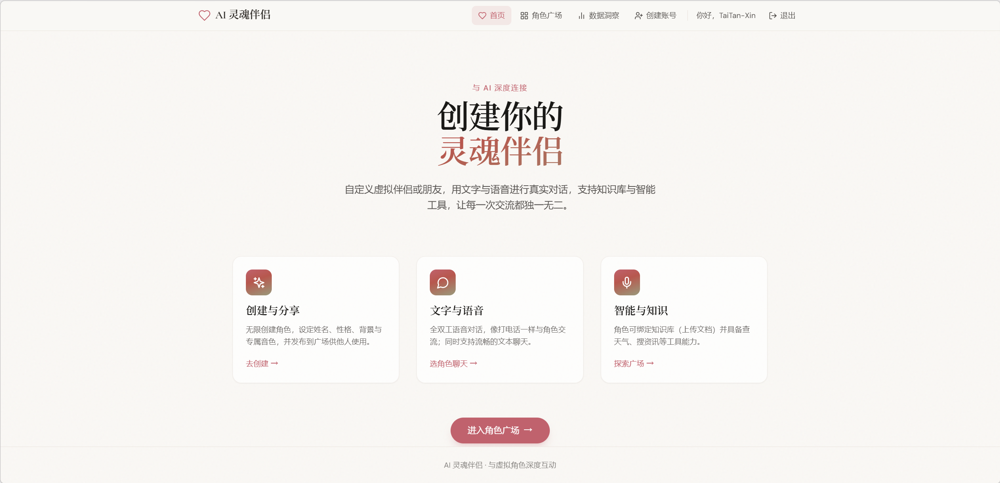
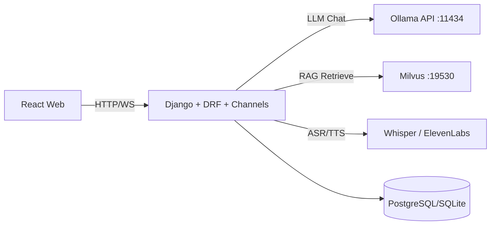

# AI SoulMate: 本地大模型驱动的 UGC 灵魂伴侣平台



一个可扩展的全栈 AI 伴侣应用：支持用户创建/发布角色（UGC）、文本与语音对话、角色知识库、工具调用。

## 核心特性

- 本地模型优先：通过 Ollama 本地部署 `qwen2.5:14b`（OpenAI 兼容接口）驱动对话能力。
- 角色 UGC：创建多个角色、设定人设、开场白、头像、音色，并发布到角色广场。
- 实时通信：Django Channels + WebSocket，支持流式对话。
- RAG 能力：角色绑定私有知识库（后续迁移至 Milvus）。
- 语音链路：ASR + TTS（后续扩展功能）。

## 技术栈

- 前端：React 18 + Vite + Tailwind CSS + Framer Motion
- 后端：Django 4 + Django REST Framework + Channels
- LLM：Ollama（`qwen2.5:14b`）+ LangChain OpenAI 兼容客户端
- 向量库：Milvus（Docker Compose 本地部署）
- 语音：Whisper ASR + ElevenLabs/CosyVoice TTS

## 架构示意




## 快速开始

### 1) 启动 Milvus（Docker Compose）

在项目根目录执行：

```bash
docker compose -p ai_voice up -d
docker compose -p ai_voice ps

# 如果无法创建，那就删除
docker rm milvus-etcd

# 如果需要额外  添加redis
docker run -d --name redis -p 6379:6379 redis:7-alpine
```

预期服务：

- `etcd`（协调元数据）
- `minio`（对象存储）
- `milvus-standalone`（向量数据库）

检查健康状态：

```bash
curl http://localhost:9091/healthz
```

返回 `OK` 表示 Milvus ready。

### 2) 启动本地 Ollama + qwen2.5:14b

```bash
ollama serve
ollama pull qwen2.5:14b
ollama run qwen2.5:14b
```

验证 OpenAI 兼容接口：

```bash
curl http://127.0.0.1:11434/v1/models
```

### 3) 启动后端

```bash
cd backend
python -m venv .venv
# Windows:
.venv\Scripts\activate
# macOS/Linux:
# source .venv/bin/activate
pip install -r requirements.txt
python manage.py migrate
python manage.py runserver 0.0.0.0:8000
```

### 4) 启动前端

```bash
cd frontend
npm install
npm run dev
```

打开 `http://localhost:3000`。

## 关键环境变量（后端）

建议在 `backend/.env` 配置：

```env
# Ollama 本地 OpenAI 兼容配置
OPENAI_BASE_URL=http://127.0.0.1:11434/v1
OPENAI_API_KEY=ollama
LLM_MODEL=qwen2.5:14b

# Milvus
MILVUS_HOST=127.0.0.1
MILVUS_PORT=19530
MILVUS_DB_NAME=default

# CORS
CORS_ORIGINS=http://localhost:3000,http://127.0.0.1:3000
```

## 项目结构

```text
.
├─ docker-compose.yml
├─ frontend/
│  └─ src/
├─ backend/
│  ├─ config/
│  └─ core/
│     ├─ models.py
│     ├─ views/
│     ├─ services/
│     └─ consumers.py
└─ README.md
```

## 路线图

- 角色创建/发布、角色广场
- 登录鉴权（Session + CSRF）
- 向量库已切换为 Milvus
- Voice Cloning API 接入
- VAD + 全双工打断
- Agent Tools（天气/资讯）落地

## 声明

本项目默认使用本地模型，不依赖远端LLM OpenAI 官方接口。
---
