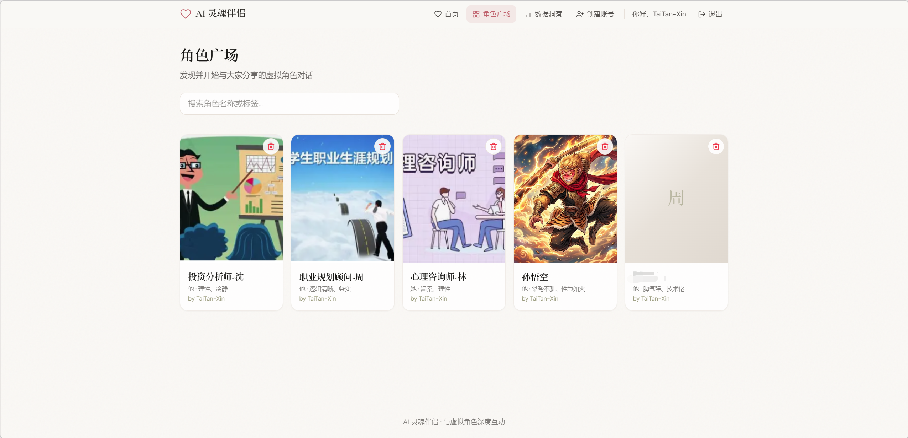
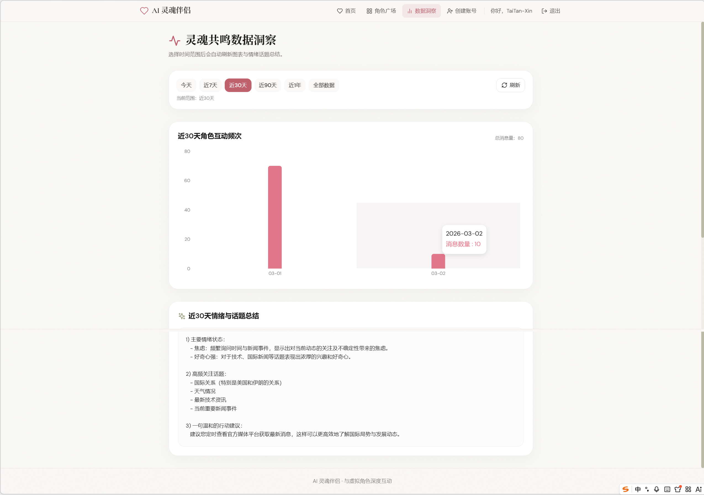
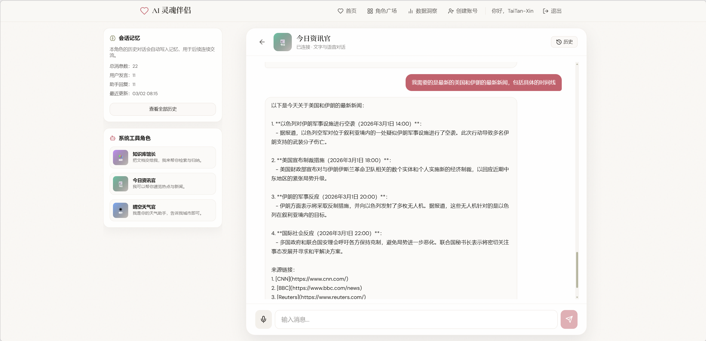
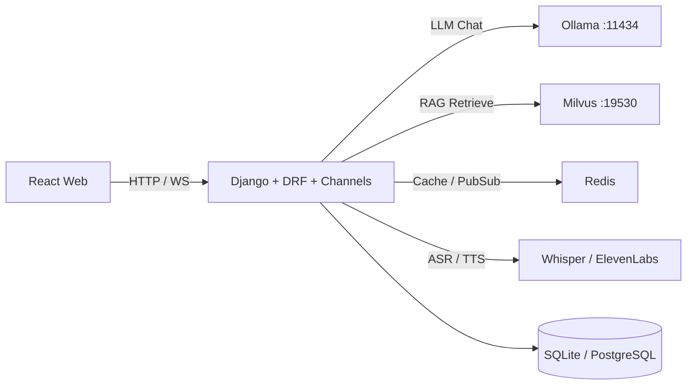

# 💬 Agent SoulMate

<p align="center">
  <a href="https://github.com/ByteTitan-star/Agent_SoulMate/releases/tag/v1.0.0"></a>
  
  
  
  <a href="LICENSE"></a>
  
  <a href="./README_zh.md"></a>
</p>

> A local-LLM-first AI companion platform: create and publish UGC characters,
> chat in real time with streaming replies, ground answers with private RAG,
> and call agent tools — all runnable on your own machine.

<p align="center">
  
</p>

## What is Agent SoulMate?

Agent SoulMate is a full-stack AI companion workspace driven by local models (Ollama). Users create characters with personality, opening lines, avatars, and knowledge bases; publish them to a character plaza; and chat over WebSocket with streaming responses. Admins manage permissions; owners manage their own characters; dashboards summarize chat and token usage with Redis-backed caching.

## Product flow

| Stage | Key action | Stage output |
| --- | --- | --- |
| Account & access | Register / sign in; admins control create & publish permissions | Authenticated session with role-based gates |
| Character design | Define persona, opening message, avatar, and optional RAG documents | A private or public companion character |
| Plaza discovery | Browse published characters and start a conversation | A chat session bound to a character |
| Streaming dialogue | Talk over WebSocket; LLM streams tokens with optional tools & RAG | Real-time companion replies |
| Insight & ops | View dashboard analytics; warm Redis stats cache when needed | Usage insights for creators and admins |

## Product interface

| Home | Character plaza |
| --- | --- |
|  |  |
| Enter the workspace and pick a companion. | Discover and start chats with published UGC characters. |

| Analytics dashboard | Tool-assisted chat |
| --- | --- |
|  |  |
| Inspect chat volume, token usage, and trends. | Characters can call weather / news skills during dialogue. |

## Core features

| Core feature | Description |
| --- | --- |
| Local-LLM first | Chat via Ollama OpenAI-compatible APIs (default `qwen2.5:14b`); no cloud LLM required by default |
| UGC characters | Create personas with prompts, openings, avatars; publish to the plaza |
| My Characters | Owners edit, publish, unpublish, and delete their characters |
| Admin permissions | `is_admin` gates; toggle `can_create_character` / `can_publish_character` per user |
| Real-time streaming | Django Channels + WebSocket for token-by-token replies |
| RAG knowledge | Per-character document retrieval (Milvus) injected into the system context |
| Agent tools | Weather and news skills for grounded, actionable answers |
| Stats cache | Redis-backed dashboard aggregation with management warm commands |

## Tech stack

| Layer | Choice |
| --- | --- |
| Frontend | React 18 · Vite · TypeScript · Tailwind CSS · Framer Motion · Recharts |
| Backend | Django 4.2 · Django REST Framework · Channels / Daphne |
| LLM | Ollama · LangChain OpenAI-compatible client |
| Vector DB | Milvus (Docker Compose) |
| Cache / WS | Redis |
| Optional voice | Whisper ASR · ElevenLabs / CosyVoice TTS |

## Architecture


```mermaid
flowchart LR
  A[React Web] -->|HTTP / WS| B[Django + DRF + Channels]
  B -->|LLM Chat| C[Ollama :11434]
  B -->|RAG Retrieve| D[Milvus :19530]
  B -->|Cache / PubSub| E[Redis]
  B -->|ASR / TTS| F[Whisper / ElevenLabs]
  B --> G[(SQLite / PostgreSQL)]
```

## Quick start

### Prerequisites

- Python 3.12+
- Node.js 18+
- Docker / Docker Compose
- [Ollama](https://ollama.com/) with a chat model (e.g. `qwen2.5:14b`)

### 1) Infrastructure (Milvus + Redis)

```bash
docker compose up -d
docker compose ps
curl http://localhost:9091/healthz   # expect OK
```

### 2) Ollama

```bash
ollama serve
ollama pull qwen2.5:14b
curl http://127.0.0.1:11434/v1/models
```

### 3) Backend

```bash
cd backend
python -m venv .venv
# Windows: .venv\Scripts\activate
# macOS / Linux: source .venv/bin/activate
pip install -r requirements.txt
cp .env.example .env   # edit secrets and REDIS_URL / LLM settings
python manage.py migrate
python manage.py runserver 0.0.0.0:8000
```

### 4) Frontend

```bash
cd frontend
npm install
npm run dev
```

Open `http://localhost:3000`.

### Optional ops commands

```bash
cd backend
python manage.py seed_plaza_characters
python manage.py warm_stats_cache --username <admin_username>
```

## Configuration

Copy `backend/.env.example` to `backend/.env`. Common keys:

```env
DEBUG=1
DJANGO_SECRET_KEY=change-me
CORS_ORIGINS=http://localhost:3000,http://127.0.0.1:3000

OPENAI_API_KEY=ollama
OPENAI_BASE_URL=http://127.0.0.1:11434/v1
LLM_MODEL=qwen2.5:14b

REDIS_URL=redis://127.0.0.1:6380/0

# Optional tool APIs
QWEATHER_API_KEY=
TIANAPI_KEY=

# Optional token usage log path (defaults under backend/data/)
TOKEN_LOG_PATH=
```

> Secrets stay in `.env` (gitignored). Never commit real API keys.

## Project structure

```text
.
├─ docker-compose.yml          # Redis + etcd + MinIO + Milvus
├─ figures/                    # Product screenshots
├─ docs/                       # Sample knowledge-base assets
├─ frontend/                   # React + Vite app
├─ backend/
│  ├─ config/                  # Django settings / ASGI
│  ├─ core/                    # Models, APIs, WS consumers, services
│  ├─ skills/                  # Agent skill packages (weather / news / …)
│  └─ .env.example
├─ scripts/                    # Repo tooling (e.g. secret scan)
├─ tests/                      # Smoke tests
├─ README.md
└─ README_zh.md
```

## Development & quality

```bash
# Python tooling (see pyproject.toml / requirements-dev.txt)
pip install -r requirements-dev.txt
pre-commit install

# Frontend production build
cd frontend && npm run build
```

CI and pre-commit hooks cover formatting, lint, and basic secret scanning. See `.pre-commit-config.yaml` and `.gitlab-ci.yml`.

## Roadmap

- [x] Character create / publish / plaza
- [x] Auth + admin permission controls
- [x] Milvus RAG + agent tools (weather / news)
- [x] Dashboard stats with Redis cache
- [ ] Voice cloning API integration
- [ ] VAD + full-duplex barge-in
- [ ] Richer multi-tool agent orchestration

## License

MIT © CodeTitan, 2026 — see [LICENSE](LICENSE).

Default runtime uses **local** Ollama models and does not require the official OpenAI cloud API.
