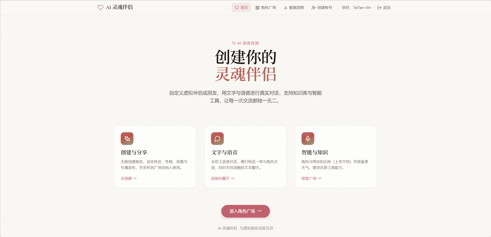

# AI SoulMate: A Local LLM-Driven UGC Soulmate Platform



A scalable full-stack AI companion application that supports user-created/published characters (UGC), text and voice conversations, character knowledge bases, and tool usage.

## Core Features

- **Local Model First**: Leverages `qwen2.5:14b` deployed locally via Ollama (OpenAI-compatible interface) to power conversation capabilities.
- **Character UGC**: Create multiple characters, define personas, opening lines, avatars, voice tones, and publish them to a character square.
- **Real-time Communication**: Django Channels + WebSocket support streaming conversations.
- **RAG Capabilities**: Characters can be bound to private knowledge bases (to be migrated to Milvus).
- **Voice Pipeline**: ASR + TTS (future extension).

## Tech Stack

- **Frontend**: React 18 + Vite + Tailwind CSS + Framer Motion
- **Backend**: Django 4 + Django REST Framework + Channels
- **LLM**: Ollama (`qwen2.5:14b`) + LangChain OpenAI-compatible client
- **Vector Database**: Milvus (deployed locally via Docker Compose)
- **Voice**: Whisper ASR + ElevenLabs/CosyVoice TTS

## Architecture Diagram

```mermaid
flowchart LR
  A[React Web] -->|HTTP/WS| B[Django + DRF + Channels]
  B -->|LLM Chat| C[Ollama API :11434]
  B -->|RAG Retrieve| D[Milvus :19530]
  B -->|ASR/TTS| E[Whisper / ElevenLabs]
  B --> F[(PostgreSQL/SQLite)]


## Quick Start

### 1) Start Milvus (Docker Compose)

Run the following commands in the project root:

```bash
docker compose -p ai_voice up -d
docker compose -p ai_voice ps

# If creation fails, delete the existing container
docker rm milvus-etcd

# If additional Redis is needed
docker run -d --name redis -p 6379:6379 redis:7-alpine
```

Expected services:

- `etcd` (coordination metadata)
- `minio`(object storage)
- `milvus-standalone`（vector database)

Check health status:

```bash
curl http://localhost:9091/healthz
```

A return of OK indicates Milvus is ready.

### 2) Start Local Ollama + qwen2.5:14b

```bash
ollama serve
ollama pull qwen2.5:14b
ollama run qwen2.5:14b
```

Verify the OpenAI-compatible interface:

```bash
curl http://127.0.0.1:11434/v1/models
```

### 3) Start the Backend

```bash
cd backend
python -m venv .venv
# Windows:
.venv\Scripts\activate
# macOS/Linux:
# source .venv/bin/activate
pip install -r requirements.txt
python manage.py migrate
python manage.py runserver 0.0.0.0:8000
```

### 4)  Start the Frontend

```bash
cd frontend
npm install
npm run dev
```

Open `http://localhost:3000`。

## Key Environment Variables (Backend)

It is recommended to configure backend/.env as follows:

```env
# Ollama local OpenAI-compatible configuration
OPENAI_BASE_URL=http://127.0.0.1:11434/v1
OPENAI_API_KEY=ollama
LLM_MODEL=qwen2.5:14b

# Milvus
MILVUS_HOST=127.0.0.1
MILVUS_PORT=19530
MILVUS_DB_NAME=default

# CORS
CORS_ORIGINS=http://localhost:3000,http://127.0.0.1:3000
```

## Project Structure

```text
.
├─ docker-compose.yml
├─ frontend/
│  └─ src/
├─ backend/
│  ├─ config/
│  └─ core/
│     ├─ models.py
│     ├─ views/
│     ├─ services/
│     └─ consumers.py
└─ README.md
```

## Roadmap

- Character creation/publishing, character square
- Login authentication (Session + CSRF)
- Vector database migrated to Milvus
- Voice Cloning API integration
- VAD + full-duplex interruption
- Agent Tools (weather/news) implementation

## Disclaimer

This project uses local models by default and does not rely on remote OpenAI official LLM APIs.
---

*Developed with ❤️ by ByteTitan-star*
