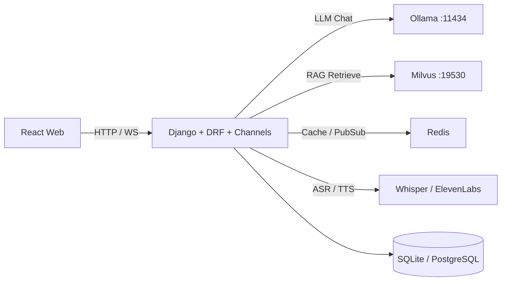

# 💬 Agent SoulMate

<p align="center">
  <a href="https://github.com/ByteTitan-star/Agent_SoulMate/releases/tag/v1.0.0"></a>
  
  
  
  
  
  <a href="LICENSE"></a>
  <a href="./README.md"></a>
  
</p>

> 本地大模型优先的 AI 伴侣平台：支持 UGC 角色创建与发布、实时流式对话、
> 私有知识库 RAG，以及 Agent 工具调用——可在本机完整跑通。

<p align="center">
  
</p>

## Agent SoulMate 是什么

Agent SoulMate 是一个由本地模型（Ollama）驱动的全栈 AI 伴侣工作区。用户可以创建带有人设、开场白、头像与知识库的角色，发布到角色广场，并通过 WebSocket 进行流式对话。管理员可管理权限；创作者可管理自己的角色；数据看板在 Redis 缓存加持下汇总对话与 Token 用量。

## 产品链路

| 阶段 | 关键动作 | 阶段结果 |
| --- | --- | --- |
| 账号与权限 | 注册 / 登录；管理员控制创建与发布权限 | 带角色门禁的已认证会话 |
| 角色设计 | 配置人设、开场白、头像，以及可选 RAG 文档 | 私有或公开的伴侣角色 |
| 广场发现 | 浏览已发布角色并开始对话 | 绑定角色的聊天会话 |
| 流式对话 | WebSocket 对话；LLM 流式输出，可叠加工具与 RAG | 实时伴侣回复 |
| 洞察与运维 | 查看数据看板；按需预热 Redis 统计缓存 | 创作者与管理员可用的用量洞察 |

## 产品界面

| 首页 | 角色广场 |
| --- | --- |
|  |  |
| 进入工作区并选择伴侣。 | 发现并与已发布的 UGC 角色开始聊天。 |

| 数据看板 | 工具增强对话 |
| --- | --- |
|  |  |
| 查看对话量、Token 用量与趋势。 | 角色可在对话中调用天气 / 资讯技能。 |

## 核心特性

| 核心特性 | 说明 |
| --- | --- |
| 本地模型优先 | 通过 Ollama OpenAI 兼容接口对话（默认 `qwen2.5:14b`）；默认不依赖云端 LLM |
| UGC 角色 | 创建人设、开场白、头像，并发布到角色广场 |
| 我的角色 | 创作者可编辑、发布、下架与删除自己的角色 |
| 管理员权限 | `is_admin` 门禁；可按用户开关 `can_create_character` / `can_publish_character` |
| 实时流式 | Django Channels + WebSocket，逐 token 输出 |
| RAG 知识库 | 角色级文档检索（Milvus）注入系统上下文 |
| 音色克隆 | 在「我的角色」上传 10–30 秒 `.wav`，绑定 ElevenLabs `voice_id` 用于 TTS 回复 |
| Agent 工具 | 天气、资讯等技能，让回答更可落地 |
| 统计缓存 | 基于 Redis 的看板聚合，附带预热管理命令 |

## 技术栈

| 层级 | 选型 |
| --- | --- |
| 前端 | React 18 · Vite · TypeScript · Tailwind CSS · Framer Motion · Recharts |
| 后端 | Django 4.2 · Django REST Framework · Channels / Daphne |
| LLM | Ollama · LangChain OpenAI 兼容客户端 |
| 向量库 | Milvus（Docker Compose） |
| 缓存 / WS | Redis |
| 可选语音 | Whisper ASR · ElevenLabs / CosyVoice TTS |

## 架构示意



## 快速开始

### 环境要求

- Python 3.12+
- Node.js 18+
- Docker / Docker Compose
- [Ollama](https://ollama.com/)，并准备聊天模型（如 `qwen2.5:14b`）

### 1) 基础设施（Milvus + Redis）

```bash
docker compose up -d
docker compose ps
curl http://localhost:9091/healthz   # 期望返回 OK
```

### 2) Ollama

```bash
ollama serve
ollama pull qwen2.5:14b
curl http://127.0.0.1:11434/v1/models
```

### 3) 后端

```bash
cd backend
python -m venv .venv
# Windows: .venv\Scripts\activate
# macOS / Linux: source .venv/bin/activate
pip install -r requirements.txt
cp .env.example .env   # 编辑密钥与 REDIS_URL / LLM 配置
python manage.py migrate
python manage.py runserver 0.0.0.0:8000
```

### 4) 前端

```bash
cd frontend
npm install
npm run dev
```

打开 `http://localhost:3000`。

### 可选运维命令

```bash
cd backend
python manage.py seed_plaza_characters
python manage.py warm_stats_cache --username <admin_username>
```

## 配置说明

将 `backend/.env.example` 复制为 `backend/.env`。常用项：

```env
DEBUG=1
DJANGO_SECRET_KEY=change-me
CORS_ORIGINS=http://localhost:3000,http://127.0.0.1:3000

OPENAI_API_KEY=ollama
OPENAI_BASE_URL=http://127.0.0.1:11434/v1
LLM_MODEL=qwen2.5:14b

REDIS_URL=redis://127.0.0.1:6380/0

# 可选工具 API
QWEATHER_API_KEY=
TIANAPI_KEY=

# 可选 Token 用量日志路径（默认在 backend/data/ 下）
TOKEN_LOG_PATH=
```

> 密钥只放在 `.env`（已 gitignore），不要提交真实 API Key。

## 项目结构

```text
.
├─ docker-compose.yml          # Redis + etcd + MinIO + Milvus
├─ figures/                    # 产品截图
├─ docs/                       # 示例知识库素材
├─ frontend/                   # React + Vite
├─ backend/
│  ├─ config/                  # Django settings / ASGI
│  ├─ core/                    # 模型、API、WS、服务
│  ├─ skills/                  # Agent 技能包（天气 / 资讯等）
│  └─ .env.example
├─ scripts/                    # 仓库工具（如 secret scan）
├─ tests/                      # 冒烟测试
├─ README.md
└─ README_zh.md
```

## 开发与质量

```bash
# Python 工具链（见 pyproject.toml / requirements-dev.txt）
pip install -r requirements-dev.txt
pre-commit install

# 前端生产构建
cd frontend && npm run build
```

CI 与 pre-commit 覆盖格式化、Lint 与基础密钥扫描。详见 `.pre-commit-config.yaml` 与 `.gitlab-ci.yml`。

## 路线图

- [x] 角色创建 / 发布 / 广场
- [x] 鉴权 + 管理员权限控制
- [x] Milvus RAG + Agent 工具（天气 / 资讯）
- [x] 数据看板 + Redis 统计缓存
- [x] Voice Cloning API 接入（ElevenLabs +「我的角色」上传）
- [x] VAD + 全双工打断（能量 VAD、WS 打断、TTS 播放）
- [ ] 更丰富的多工具 Agent 编排

## 许可证

MIT © CodeTitan, 2026 — 详见 [LICENSE](LICENSE)。

默认运行时使用**本地** Ollama 模型，不依赖 OpenAI 官方云端 API。
